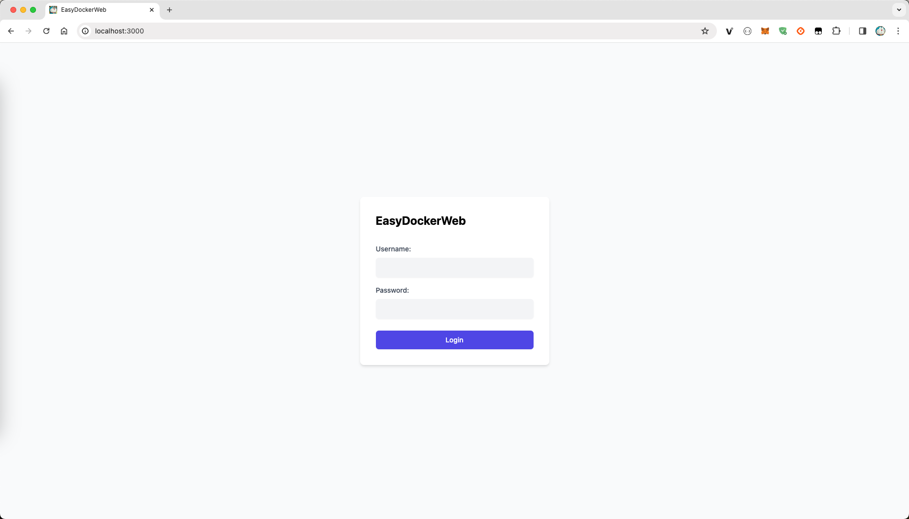

# EasyDockerWeb

A simple Web UI for Docker using `xterm.js`, `Node.js` and `Socket.io`.

With this solution you will be able to create your own SAS service.

Features:
- Container management (create, delete, start, stop)
- Interactive terminal
- Log viewer
- System status monitoring
- Image search and pull
- Simple authentication

## Quick Start

### Method 1: Using build script (Recommended)
```bash
git clone https://github.com/qfdk/EasyDockerWeb.git
cd EasyDockerWeb
chmod +x build.sh
./build.sh
```

### Method 2: Manual deployment
```bash
# Build the image
docker build -t easy-docker-web .

# Run the container
docker run -d \
  --name easy-docker-web \
  -p 3000:3000 \
  -v /var/run/docker.sock:/var/run/docker.sock \
  easy-docker-web
```

Access the web interface at [http://localhost:3000](http://localhost:3000)

Default credentials: **admin/admin**

You can customize the username and password by setting environment variables:
```bash
docker run -d \
  --name easy-docker-web \
  -p 3000:3000 \
  -v /var/run/docker.sock:/var/run/docker.sock \
  -e EDW_USERNAME='your_username' \
  -e EDW_PASSWORD='your_password' \
  easy-docker-web
```

## Requirements

- Docker Engine with Remote API >= v1.24
- Linux, macOS, or Windows with Docker installed

## Development Mode

```bash
git clone https://github.com/qfdk/EasyDockerWeb.git
cd EasyDockerWeb
pnpm install
pnpm start
```

## 中文说明

简单的 docker 管理程序，使用了 express socket.io 来实现前后端通讯。

功能特点：
- 容器增删改查
- 容器交互终端
- 日志查看
- 系统状态监控
- 镜像搜索和拉取
- 简单的身份验证

### 快速开始

#### 方式一：使用构建脚本（推荐）
```bash
git clone https://github.com/qfdk/EasyDockerWeb.git
cd EasyDockerWeb
chmod +x build.sh
./build.sh
```

#### 方式二：手动部署
```bash
# 构建镜像
docker build -t easy-docker-web .

# 运行容器
docker run -d \
  --name easy-docker-web \
  -p 3000:3000 \
  -v /var/run/docker.sock:/var/run/docker.sock \
  easy-docker-web
```

访问地址：[http://localhost:3000](http://localhost:3000)

默认账号密码：**admin/admin**

## Images



## Sponsor
<a href="https://www.jetbrains.com/?from=EasyDockerWeb"></a>
